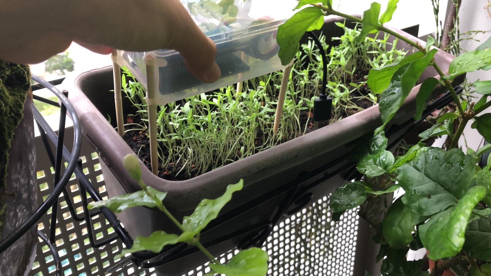
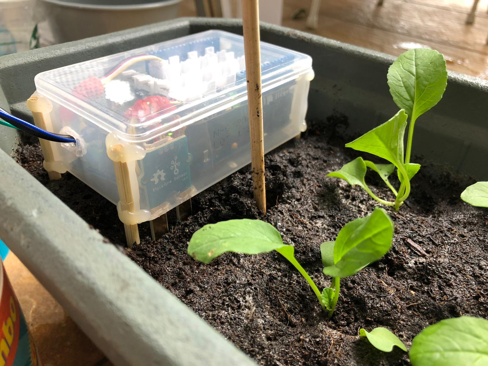
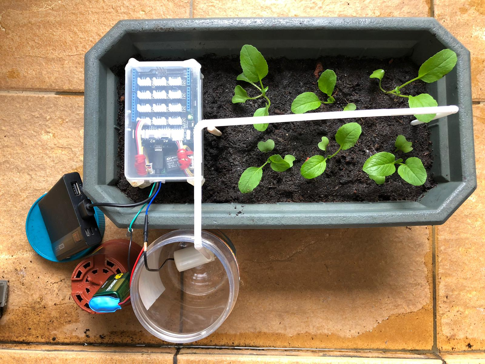

# farmer

A WiFi-connected plant-watering rig built on an Arduino MKR1000: it reads soil moisture, waters the plant when the soil dries out, logs readings to ThingSpeak, and exposes a web UI plus IFTTT hooks for remote and voice control.





## Features

- Auto-watering: pumps for 2 seconds when the smoothed moisture reading drops below a threshold
- Rolling-average smoothing over 10 analog reads to suppress sensor noise
- Logs moisture readings to a ThingSpeak channel every 15 seconds
- IFTTT Webhooks notification when the soil goes dry
- On-board HTTP server with a small web UI for manual pump control and threshold adjustment
- Voice control via IFTTT applets (Siri Shortcuts, Google Assistant) hitting the same webhook

## Hardware

- Arduino MKR1000
- Capacitive or resistive soil moisture sensor (analog out)
- 5V electromagnetic relay module
- Small DC water pump
- Grove connectors / shield (optional, for tidy wiring)
- 5V power supply for the pump

## Pinout

| Pin | Connection            |
|-----|-----------------------|
| A0  | Soil moisture sensor  |
| D4  | Relay control (pump)  |

Threshold defaults to `300`. As a rough guide: `~700` is humid soil, `~300` is dry.

## Setup

1. Install the Arduino IDE and add board support for the **Arduino SAMD Boards** package, then select **Arduino MKR1000** as the target.
2. Install the required libraries via the Library Manager:
   - `WiFi101`
3. Create a ThingSpeak channel with one field (`field1` = moisture) and copy its **Write API Key**.
4. Create an IFTTT Webhooks applet with the event name `moistureStatus` and copy your Webhooks key (from `https://maker.ifttt.com/use/<key>`).
5. Copy the secrets template and fill in your values:

   ```bash
   cp secrets.h.example secrets.h
   ```

   Then edit `secrets.h`:

   ```c
   #define SECRET_SSID         "YOUR_WIFI_SSID"
   #define SECRET_PASS         "YOUR_WIFI_PASSWORD"
   #define SECRET_APIKEY       "YOUR_THINGSPEAK_WRITE_API_KEY"
   #define SECRET_IFTTT_APIKEY "YOUR_IFTTT_WEBHOOKS_KEY"
   ```

   `secrets.h` is gitignored.

## Build & flash

1. Open `main.ino` in the Arduino IDE.
2. Confirm the board is set to **Arduino MKR1000** and the right serial port is selected.
3. Click **Verify**, then **Upload**.
4. Open the Serial Monitor at `9600` baud to see the device's IP address once it joins WiFi.

## Usage

Once flashed, the device prints its local IP to serial on every cycle. Visit it in a browser:

```
http://<device-ip>/
```

The UI exposes four endpoints:

| Endpoint | Action                                          |
|----------|-------------------------------------------------|
| `/A`     | Toggle pump between `auto` and `manual` modes   |
| `/B`     | Water the plant now (2-second pump pulse)       |
| `/C`     | Increase moisture threshold by 25               |
| `/D`     | Decrease moisture threshold by 25               |

In `auto` mode, the pump fires whenever the smoothed reading falls below the threshold. In `manual` mode, it only fires when you hit `/B`.

### Voice control via IFTTT

Wire an IFTTT applet (Siri Shortcut or Google Assistant) to a Webhooks action that GETs your device on the local network, e.g.:

```
http://<device-ip>/B
```

Example phrases:

- "Hey Siri, water the plant" -> `GET /B`
- "Hey Google, set the plant to manual" -> `GET /A`

For this to work over voice, the device and the phone/assistant must be on the same network (or you need a tunnel / port-forward in front of it).

## License

MIT (c) Jeon Wonje
